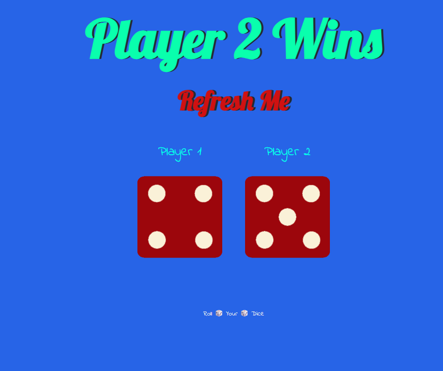

# 🎲 Dice Game  

A fun and interactive **Dice Game** built using HTML, CSS, and JavaScript.  
The game simulates a two-player dice roll and displays the winner dynamically with visuals.

---

## 🌐 Live Demo  
🔗 [Dice Game](https://adityamahekar.github.io/Dice_Game/)

---

## 🚀 Features  
- 🎲 Simulates rolling two dice  
- 👥 Two-player mode  
- 🖼️ Dice images change based on random outcome  
- ⚡ Fast and responsive interactions  
- 🧠 Simple logic with randomization  

---

## 🛠️ Tech Stack  
- **Frontend**: HTML, CSS, JavaScript  
- **Deployment**: GitHub Pages  

---

## 📷 Gallery  

| Dice Game UI |
|--------------|
|  |

---

